# Why SolRL

SolRL is infrastructure for verifiable RL reward generation.

AI teams are moving from evals as reporting to evals as training infrastructure. Every agent rollout can produce a reward signal, and that reward can become training data.

SolRL makes those reward rollouts verifiable, payable, and auditable across operators the buyer does not have to trust.

If the reward is fake, the model learns from a lie. SolRL is built to make that failure expensive and detectable.

## Slide 1: The Shift

Agent evaluation is becoming part of the training loop.

In reinforcement learning, the reward is not a dashboard metric. It is the signal the model trains against. For coding agents, web agents, and tool-using systems, that reward often comes from an executable environment.

The loop looks like this:

- give the agent an instruction
- drop it into a sandbox
- let it use tools
- collect the trajectory
- run a verifier script
- turn the result into a scalar reward

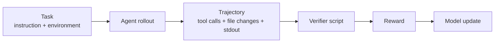

This is why RLVR matters. Reinforcement Learning from Verifiable Rewards replaces human judgment with reward signals from checkable outcomes: tests, executable feedback, formal validation, tool results, or environment state.

That shift creates a new infrastructure requirement: the training system has to trust the reward source.

## Slide 2: The Bottleneck

Harbor shows the shape of the workload clearly.

A Harbor task is an instruction, a container environment, and a test script. A dataset is a group of those tasks for evals, training, and prompt tuning. A run produces trials, trajectories, verifier output, and rewards.

Agent teams need to run this loop repeatedly across model checkpoints, prompts, scaffolds, tool policies, and datasets:

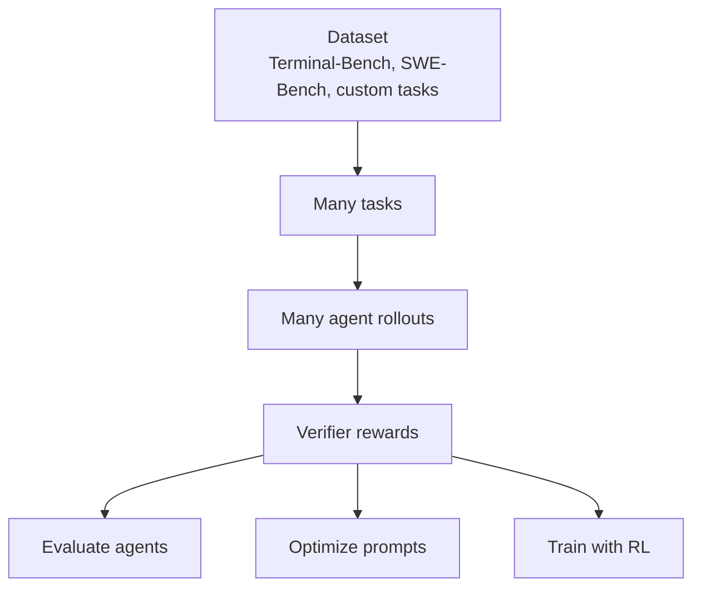

These rollouts are not cheap API calls. They can involve full containers, package installs, repos, test suites, long terminal sessions, tool failures, retries, and artifact collection.

The customer is paying for trustworthy reward data, not raw CPU cycles.

## Slide 3: The Market Failure

Centralized labs can run rollouts on their own infrastructure because they trust their own machines.

A decentralized operator market has a different trust model.

If an operator is paid per successful rollout, the easiest attack is obvious:

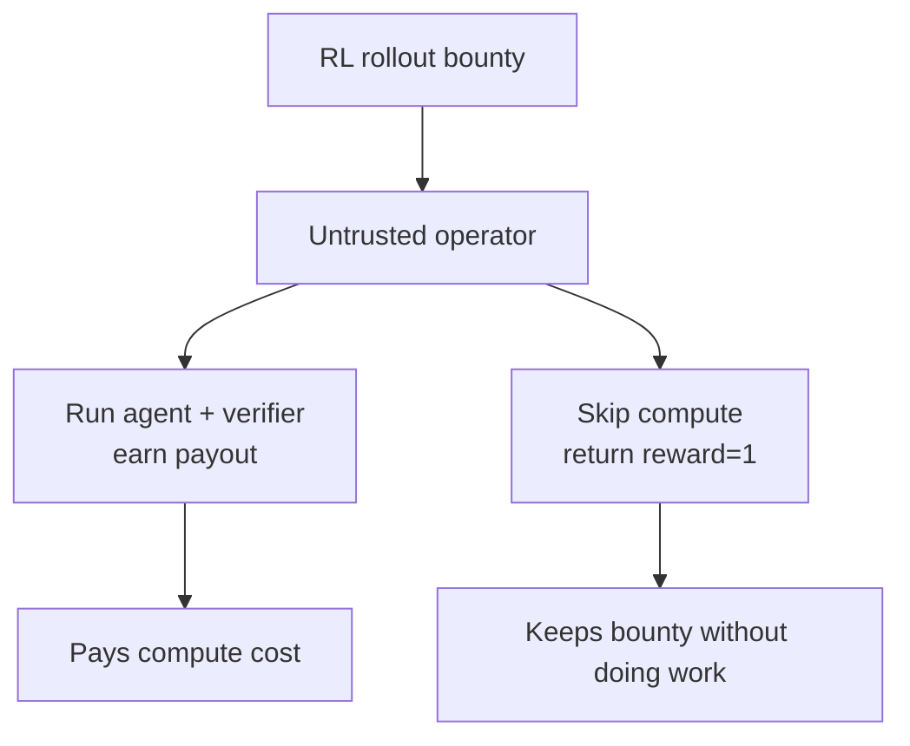

Fake rewards create two business problems:

- **payment fraud:** the operator gets paid for work they did not do
- **training poisoning:** the buyer may train on false reward signals

The second one is the larger risk. A fake reward can push the model toward behavior that never actually solved the task. The training loop becomes a system for amplifying bad evidence.

## Slide 4: Why Containers Are Not Enough

Containers are useful when the lab owns the host.

They are not enough when the host is owned by the operator.

Docker, Sysbox, and normal VM sandboxes can isolate processes, but they do not remove the host owner from the trust boundary. The operator can control the runtime, patch the image, tamper with logs, replay a previous result, or claim a verifier passed when it never ran.

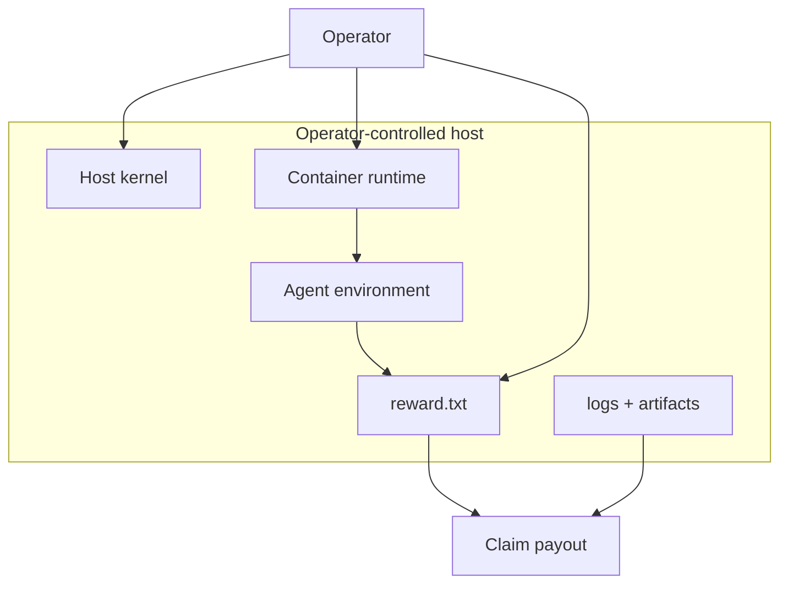

The issue is not "containers are bad."

The issue is that host-controlled evidence is weak evidence.

For RL markets, the reward signal has to survive an adversarial operator.

## Slide 5: What AWS Nitro Gives Us

AWS Nitro Enclaves are Trusted Execution Environments.

In plain English: Nitro lets an EC2 instance carve out a small isolated VM called an enclave. The parent instance can launch it and send it messages, but the parent cannot SSH into it, mount its disk, read its memory, or inspect its processes.

Nitro enclaves are constrained on purpose:

- no persistent storage
- no interactive access
- no normal external networking
- no SSH
- only local VSOCK communication with the parent

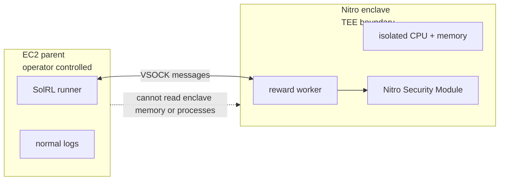

This gives the reward worker a smaller trust boundary than the operator's machine.

The operator can still refuse to run the job. The operator can still go offline. But the operator should not be able to cheaply forge a valid reward claim for code that never ran inside the measured enclave.

That is the property RL reward markets need: the host can provide capacity without becoming the source of truth.

## Slide 6: What Attestation Gives Us

Isolation alone is not enough. The buyer also needs proof.

Inside a Nitro enclave, the worker can ask the Nitro Security Module for a signed attestation document. That document is rooted in AWS Nitro Attestation PKI and includes measurements called PCRs.

For SolRL, the important fields are:

- **PCR0, PCR1, PCR2:** measurements for the enclave image, kernel/bootstrap, and application
- **PCR16:** a custom SolRL measurement for job and claim context
- **user_data:** the reward or output hash we want to bind to the attestation
- **public_key:** the worker key used to bind the response channel
- **nonce:** replay-resistant protocol input

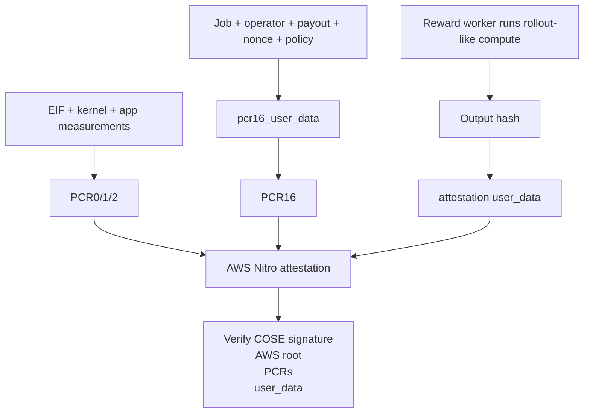

This changes the quality of the evidence. The reward is no longer just a file from an operator-controlled host. It is bound to a hardware-rooted statement about the code and context that produced it.

## Slide 7: What SolRL Adds

Nitro proves a measured enclave produced a signed statement.

SolRL turns that statement into a protocol action.

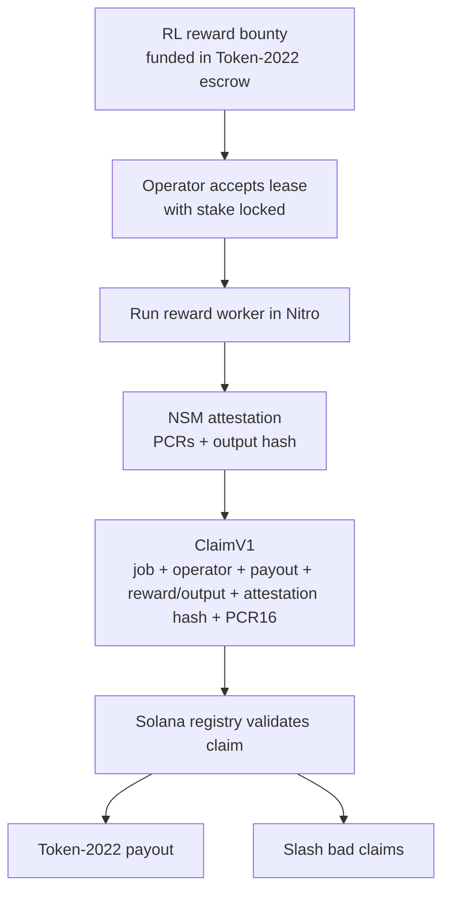

SolRL adds:

- a canonical ClaimV1 schema shared by Rust and Python
- PCR16 binding between Nitro context and registry state
- verifier policy checks
- replay protection with claim and nonce receipts
- Token-2022 escrow payout
- Token-2022 stake slashing
- proof bundles that let a reviewer inspect the run

The result is a reward claim that can drive payment and training decisions without relying on the operator's word.

## Slide 8: Why The Token Exists

The token is the market control rail.

SolRL needs one asset that can move through all four states of the rollout market:

1. **Escrow:** the requester funds reward generation before work starts.
2. **Stake:** the operator locks collateral before accepting leases.
3. **Settlement:** a valid ClaimV1 releases escrow to the operator.
4. **Slashing:** a valid SlashClaimV1 moves stake to treasury.

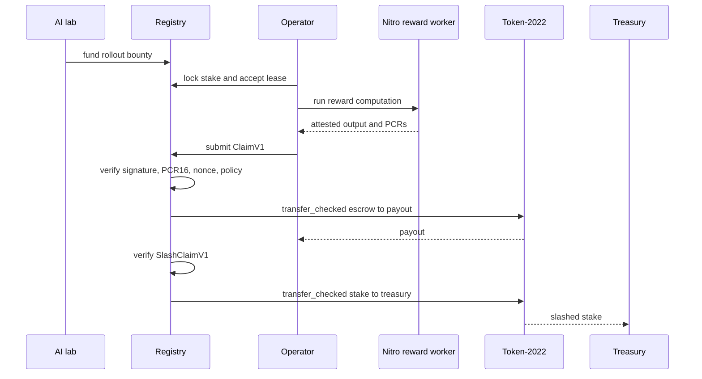

This is not a tokenomics claim. The token matters because it makes reward generation economically enforceable: honest work gets paid, invalid claims can be rejected or slashed, and requesters do not need bilateral trust with every operator.

## Slide 9: Why Token-2022

SolRL uses Solana Token-2022 because the settlement rail needs standard token movement and room for protocol controls.

Today, V1 uses Token-2022 `transfer_checked` CPI from the registry:

- `settle_claim` moves job escrow to operator payout
- `slash_operator` moves operator stake to treasury
- `withdraw_stake` lets idle operators exit through the same checked transfer path
- a local-validator test proves real Token-2022 balances move, not just mock state

The V1 boundary is explicit: V1 does not use the transfer hook as the full claim verifier. Program-initiated settlement uses registry PDA authority because same-program `registry -> Token-2022 -> registry hook` reentry is rejected by Solana.

The settlement primitive is still real Token-2022 account movement, proven by the local-validator balance test.

## Slide 10: What Works Today

SolRL V1 proves three connected pieces of the system.

Current shipped evidence:

- real AWS Nitro boot
- commit-pinned GHCR EIF
- COSE/AWS root attestation verification
- non-zero PCR0, PCR1, PCR2, and PCR16 checks
- `SOLRL_PCR16 == SOLRL_CLAIM_PCR16`
- reward-like output hash bound to attestation `user_data`
- ClaimV1 receipt with attestation hash and output hash
- Token-2022 local-validator balance movement
- exact-tag AWS cleanup and post-audit
- self-contained proof bundle

Current boundary: the real AWS proof bundle is not yet submitted to public devnet settlement. V1 proves the hardware reward rail and the token settlement rail, using the same ClaimV1 shape between them. The next integration step is feeding the real AWS ClaimV1 receipt into a public devnet `settle_claim` transaction.

Production Harbor-over-Nitro execution is also future work. The current Nitro worker proves the reward-attestation bridge with generic reward-like compute, not full Harbor tasks.

## Slide 11: How To Evaluate It

The cleanest evaluation path is GitHub Actions because it starts from a clean checkout and leaves run history attached to the repository.

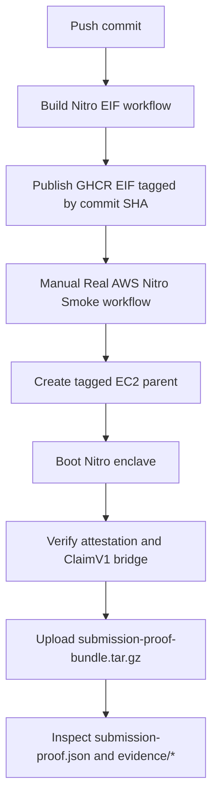

Repository setup:

1. Create a GitHub environment named `aws-gl`.
2. Add an environment secret named `ENV` with AWS credentials in `.env` format.
3. Run `Build Nitro EIF`.
4. Run `Real AWS Nitro Smoke`.
5. Download the uploaded AWS Nitro artifacts.
6. Open `submission-proof-bundle.tar.gz`.

The bundle contains:

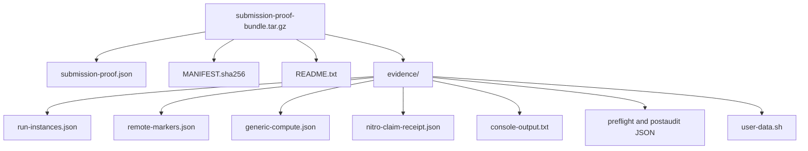

The main checks are mechanical:

- `submission-proof.json.status == "passed"`
- `submission-proof.json.checks.all == true`
- `SOLRL_STATUS == "OK"`
- `SOLRL_PCR16 == SOLRL_CLAIM_PCR16`
- `SOLRL_COMPUTE_OUTPUT_HASH == ClaimV1.trajectory_hash`
- `SOLRL_ATTESTATION_DOCUMENT_HASH == ClaimV1.attestation_document_hash`
- `run-instances.json` shows Nitro enclaves enabled
- `run-instances.json` shows IMDSv2 required
- resource tags include `Project=SolRL`, `SolRLRunId=<run-id>`, and `ManagedBy=SolRL`
- post-audit shows zero SolRL instances, security groups, and volumes left behind

## Slide 12: Who Uses This

The first users are teams that need trusted reward generation at scale:

- AI labs training agents with RLVR
- agent teams running Terminal-Bench, SWE-Bench, or custom Harbor datasets
- benchmark maintainers who need trusted third-party runs
- model teams optimizing prompts or scaffolds against executable rewards
- decentralized compute operators selling verified rollout capacity

The product is verified reward rollouts for teams whose training loops depend on reward integrity.

## Slide 13: Why This Can Become A Market

Agent evals and RL rollouts are repeat workloads.

Every model checkpoint, prompt change, scaffold change, tool policy, or agent release can create another batch of rollouts. If the workload is trusted only inside a lab's own cluster, the market is limited to centralized infra. If the reward can be verified, operators can compete to supply rollout capacity.

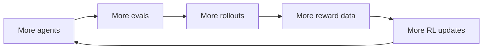

SolRL's wedge is reward integrity for outsourced RL. Container speed matters, but it does not answer the trust question by itself.

## Slide 14: Current Boundaries And Next Milestones

Several pieces sit outside V1:

- production Harbor-over-Nitro execution
- a Harbor-bearing EIF that runs arbitrary evaluation tasks
- a persistent verifier enclave network
- public devnet settlement from the latest real AWS proof bundle
- hook-side claim verification
- requester/operator UI
- production token mint governance, emissions, and reputation routing
- threshold verifier signatures
- open-internet workload policy
- dispute workflow beyond the current slash/reject taxonomy

V1 establishes the minimum proof chain: a reward-like computation can be hardware-attested, converted into ClaimV1 evidence, and matched to a Token-2022 settlement path.

## Slide 15: Why This Architecture Solves The RL Problem

The original problem was reward integrity.

SolRL changes the trust model:

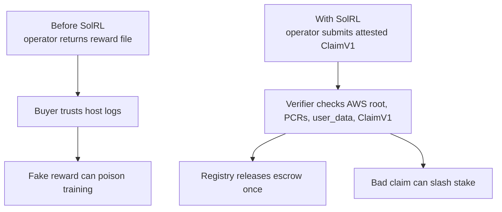

The buyer no longer treats the operator's reward file as truth. The buyer checks a hardware-rooted statement, a canonical claim, and a deterministic settlement rule.

That is the architecture:

- Harbor-style tasks define the RL workload.
- Nitro protects the reward computation from the host operator.
- Attestation makes the protected computation externally verifiable.
- ClaimV1 binds the reward to the job and payout context.
- Solana settles escrow and slashes stake.

That is the investment case: RL needs more trusted reward data, operators need a way to get paid for producing it, and the settlement layer needs proof stronger than host logs.

## Research Basis

- [Harbor docs](https://www.harborframework.com/docs) describe Harbor as a framework for evaluating and optimizing agents and models in container environments, including custom evals, prompt optimization, RL, SFT traces, and CI/CD agent testing.
- [Harbor eval docs](https://www.harborframework.com/docs/use-cases/evals) describe datasets as Harbor tasks with instruction, environment, and test script, used to evaluate, train, or tune prompts.
- [Harbor dataset docs](https://www.harborframework.com/docs/datasets) describe tasks and datasets for evals and training.
- [Harbor registry](https://registry.harborframework.com/) shows the kind of task market SolRL targets: Terminal-Bench, SWE-Bench Verified, MedAgentBench, LawBench, and other published datasets.
- [RLVR reference](https://rlvrbook.com/) frames RLVR as learning from checkable task outcomes, executable feedback, formal validation, and agent environments.
- [AWS Nitro Enclaves docs](https://docs.aws.amazon.com/enclaves/latest/user/nitro-enclave.html) describe enclaves as isolated, hardened VMs with no persistent storage, no interactive access, and no external networking.
- [AWS Nitro attestation docs](https://docs.aws.amazon.com/enclaves/latest/user/set-up-attestation.html) describe signed attestation documents and PCR measurements.
- [AWS Nitro root verification docs](https://docs.aws.amazon.com/enclaves/latest/user/verify-root.html) describe CBOR/COSE attestation documents signed by AWS Nitro Attestation PKI, including `public_key`, `user_data`, and `nonce`.
- [Solana Token-2022 docs](https://www.solana-program.com/docs/token-2022) describe Token-2022 as Solana's extensible token program.
- [Solana token transfer docs](https://solana.com/docs/tokens/basics/transfer-tokens) describe `TransferChecked`, the checked transfer primitive SolRL uses through CPI.

## References

- `README.md` contains the Docker-first verification path and GitHub Actions instructions.
- `.github/workflows/build-nitro-eif.yml` builds and publishes the commit-pinned EIF.
- `.github/workflows/aws-nitro-smoke.yml` runs the real AWS Nitro smoke path and uploads the proof bundle.
- `python/solrl_core/aws_nitro_runner.py` verifies the real Nitro attestation and builds the proof bundle.
- `programs/solrl-registry/tests/registry_flow.rs` contains the local-validator Token-2022 balance test.
- `.agents/skills/solrl-framework/` contains the operating rules for AI agents working on this repo.
