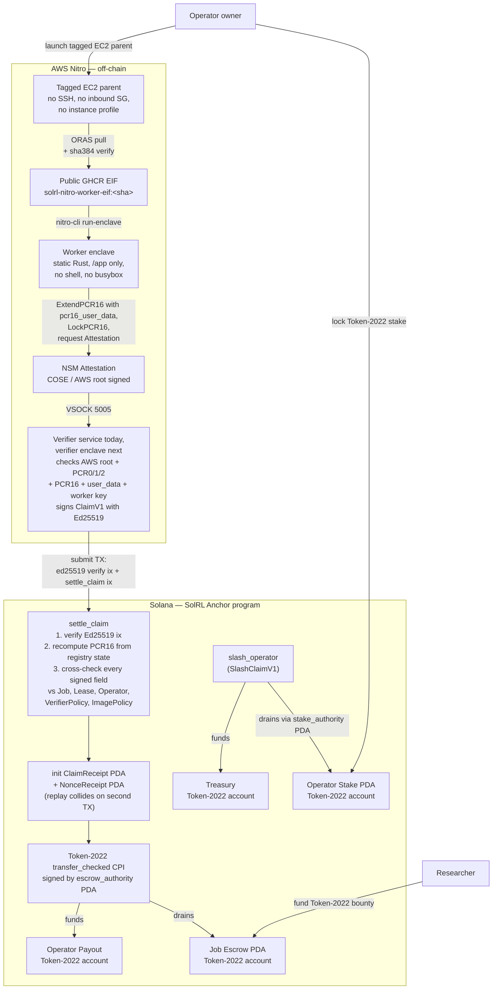

# Why SolRL

SolRL is the verifiable compute layer for reinforcement-learning agent training.

## Slide 1: The Billion-Dollar Human Monopoly

Frontier AI labs are bleeding capital on human-graded evals. RL companies have exploded to enormous scale by throwing hundreds of thousands of human contractors at AI agent evaluations — coders, doctors, lawyers, mathematicians grading agent outputs one at a time, in spreadsheets and labeling tools. The economics are real: paying a domain expert thirty dollars an hour to evaluate one agent run, multiplied by tens of thousands of runs per release, multiplied by every model checkpoint and every prompt change, is the largest line item in a modern AI lab's training budget after the GPUs themselves.

Humans are slow. A human grader produces dozens of evaluations a day. An RL training loop wants millions per checkpoint. Humans are expensive — a team of contractors costs orders of magnitude more than the same evaluations on automated infrastructure. Humans are also fundamentally insecure: the catastrophic supply-chain data breaches that centralized human-annotation businesses are currently suffering have already exposed proprietary prompts, agent trajectories, and customer interactions that were supposed to stay inside the lab.

Human-in-the-loop training was a transitional phase. It is a dead end now.

## Slide 2: The Hard Pivot to RLVR

The smartest AI labs already know human feedback does not scale. The entire industry is aggressively shifting to Reinforcement Learning from Verifiable Rewards — RLVR. Instead of paying humans to score agent outputs, the lab writes one verifier script and runs an agent inside an isolated sandbox millions of times against thousands of variations of the task. The agent's actions, the environment's state, the test outputs, and the reward number are all produced by code. The lab trains the agent against that signal directly.

This shift is creating new infrastructure companies. RL sandbox companies generate massive revenue today by hosting the millions of isolated rollouts required to train these agents. They sell the same primitive over and over: spin up a clean container, hand it the task, run the verifier, return the reward. Their bill grows linearly with every training run.

But every Web2 sandbox shares one fatal flaw: the host has full control over the kernel boundary. The container sees what the host wants it to see, the rollout produces what the host says it produced, and the reward is whatever number the host returns. For a centralized lab running its own infrastructure, that is acceptable — they trust themselves. For a decentralized compute network where any node operator can offer capacity, it is fatal.

## Slide 3: The Missing Crypto Infrastructure

AI labs want to crowdsource these massive RL workloads to a cost-effective, decentralized compute network. The economics are obvious: a global pool of operators with idle EC2 capacity, willing to undercut centralized providers in exchange for a cut of the bounty. The lab posts a task, the operator runs the rollout, the lab pays for verified work.

In a trustless network, this immediately breaks. A random node operator will simply fake the evaluation reward, return whatever number maximizes the bounty, and pocket the compute fee without doing the work. The lab cannot tell the difference because the lab does not have access to the kernel of the operator's machine. Every participant assumes the worst about every other participant — which is correct.

What breaks the cycle is hardware-rooted attestation. If the operator can prove cryptographically — with a signature rooted in a key burned into silicon — that an exact image ran an exact task and produced an exact reward, then the lab can pay safely. AWS Nitro Enclaves provide that hardware root. But there is no TEE-based RL sandbox provider on the market today, and no compute network with a token engineered specifically for RL workloads. Until now.

## Slide 4: SolRL on Solana Token-2022

SolRL V1 proves the smallest useful version of this market: a deterministic compute result is produced inside an AWS Nitro Enclave, bound to a hardware attestation, converted into a canonical ClaimV1, and settled through Solana Token-2022 escrow. Harbor remains a future integration target, not the thing V1 claims to run in production.

Bounties settle on Solana through Token-2022 escrow. A researcher funds a job by depositing tokens into a per-job escrow PDA. A staked operator accepts a lease, runs the compute inside a Nitro enclave, and produces an NSM attestation that binds the compute output, the operator, and the protocol context into one signed document. In V1 the AWS parent verifies the raw Nitro document and the runner writes a ClaimV1 receipt; the persistent verifier enclave is the next production step. The SolRL Anchor program on Solana settles the claim atomically: it verifies the Ed25519 signature, recomputes the bound hardware measurement from on-chain state, and releases the escrow to the operator's payout account through a Token-2022 `transfer_checked` CPI signed by the registry's escrow PDA.

The same rail handles failure. A separate `SlashClaimV1` path lets verifiers prove replay, forged context, or wrong-policy claims and move stake from the operator's stake vault to the treasury through the same Token-2022 `transfer_checked` CPI under a stake PDA. Bad operators lose money on the rail they earn money on.

## Slide 5: Architecture

A SolRL job flows through three cooperating layers — the researcher and operator setting up the bounty on-chain, an AWS Nitro enclave producing a hardware-attested reward, and one atomic Solana transaction that releases the escrow.

The load-bearing invariant is the **PCR16 bridge**. The Nitro worker extends PCR16 with `pcr16_user_data = sha384(domain || borsh(Pcr16Components))`, locks PCR16, and requests the attestation. The verifier checks that the AWS-signed PCR16 in the attestation equals `pcr16_digest = sha384(zeros48 || pcr16_user_data)`. The registry on Solana recomputes the same `pcr16_digest` from `Job`, `Lease`, `Operator`, and the claim nonce — every input lives on-chain or comes from the signed ClaimV1 — and rejects the claim if the value the verifier endorsed disagrees by even one byte. That is the single wire that ties the hardware proof to the token settlement; everything else is plumbing.

## Slide 6: Implementation

SolRL ships today as a Docker-first scaffold. No Rust, Anchor, Solana CLI, Node, Python, Nix, Terraform, or AWS CLI on the laptop. Everything runs through `docker compose` services with named caches.

The Anchor program in `programs/solrl-registry` compiles to SBF and contains the full registry — `Config`, `VerifierPolicy`, `Verifier`, `ImagePolicy` (PCR0/1/2 only — never PCR16), `Operator`, `Job`, `Lease`, `ClaimReceipt`, `NonceReceipt`, and `TransferGuard`. `settle_claim` performs an Ed25519 instruction-sysvar parse, recomputes PCR16 from registered components, cross-checks every signed ClaimV1 field against on-chain state, creates the receipt PDAs, and executes a Token-2022 `transfer_checked` CPI from the escrow PDA to the operator's payout account in a single atomic instruction. `slash_operator` does the same for stake-to-treasury under a separate stake PDA. `withdraw_stake` lets operators exit safely once they have no active leases.

A local-validator integration test (`settle_claim_transfers_token2022_balance_with_registry_pda_authority`) creates a real Token-2022 mint, real escrow and payout token accounts, mints `claim.amount` into escrow, sends one transaction with an Ed25519 verifier instruction plus `settle_claim`, and asserts that the escrow drains to zero and the payout receives the bounty — through the actual `spl_token_2022` processor, not a mock.

A real AWS gate launches a tagged EC2 parent with no SSH key, no inbound security group rules, no instance profile, and no SSM dependency. The parent uses ORAS to pull a CI-built EIF from public GHCR, verifies its SHA-384 sidecar, boots a Nix-built Nitro enclave with a static Rust worker, runs deterministic generic compute, requests a real NSM attestation over VSOCK, and verifies the COSE signature, AWS root certificate, PCR0/1/2/16, attestation `user_data`, and worker public key on the EC2 parent before declaring success. The runner writes `nitro-claim-receipt.json`, which binds the verified attestation document hash, generic compute output hash, and PCR16 into ClaimV1. EIFs are produced by GitHub Actions with Magic Nix Cache and published as `application/vnd.aws.nitro.eif` OCI artifacts to GHCR. The laptop never builds the real EIF.

A guardrail lint suite (`docker compose run --rm lint`) enforces ClaimV1 byte-for-byte parity between Rust and Python, signed-field coverage in `settle_claim`, Token-2022 wiring (no flag-only settlement), AWS safety (no IAM, no SSH, no inbound SG, no debug-mode enclaves, exact-tag cleanup), Docker-only execution, and Python 3.7 compatibility on the EC2-parent runtime path. Every past mistake has a regression check behind it.

## Slide 7: The Token

SolRL needs a token because the protocol needs more than a payment rail — it needs a control plane. The Token-2022 mint does four jobs:

1. **Escrow.** Researchers fund jobs by transferring tokens into a per-job escrow PDA before any work starts. Without a funded escrow, no operator can claim a lease. The escrow is owned by an `escrow_authority` PDA derived from the job account, so the registry alone can move it.
2. **Staking.** Operators must lock tokens before they can accept any lease. Stake is the collateral that makes lying expensive: an operator who fakes a reward forfeits more than the bounty they tried to steal. Stake lives in an `Operator` PDA-owned token account and cannot be withdrawn while any lease is active.
3. **Settlement.** A verified ClaimV1 releases escrow to the operator's payout account through a Token-2022 `transfer_checked` CPI signed by the escrow PDA. The transfer happens in the same atomic instruction that creates the `ClaimReceipt` and `NonceReceipt` — settlement and replay protection share one transaction. Replaying a settled claim collides with two existing PDAs and the runtime aborts the second transaction.
4. **Slashing.** A separate `SlashClaimV1` path lets a verifier prove replay, malicious duplicate, wrong-policy, wrong-job, lease abuse, or forged-context attacks. The registry decrements the operator's stake counter, marks the lease slashed, and moves stake from the operator's stake vault to the treasury PDA — again through Token-2022 `transfer_checked`. Bad operators lose money on the same rail they earn money on.

V1 settlement uses the registry PDA authority over escrow and stake vaults. The Token-2022 transfer-hook program is wired and deployed as a narrow guard for direct user transfers — it checks the mint, the pause flag, and a single-slot `TransferGuard` PDA — but it is not the settlement verifier. Solana rejects same-program reentry from the registry into its own hook (the registry calling Token-2022, which would call the registry's hook, in one transaction), so V1 keeps full claim verification inside `settle_claim` and uses PDA authorities to move tokens. Hook-only settlement requires a PDA seed redesign so the entire job graph derives from the source token account; that is a v2 item.

## Slide 8: What's Not Built Yet

V1 proves the hard technical claim: a generic compute result can be produced inside Nitro, bound to ClaimV1, and settled through Solana Token-2022, with replay protection and slashing on the same rail. Several pieces of the production network are deliberately not in V1:

- **Production Harbor-over-Nitro execution.** The Harbor `import_path` class (`solrl_harbor.nitro_environment:NitroEnvironment`) exists and runs locally; AWS mode intentionally errors until the VSOCK worker RPC for running real Harbor tasks inside the worker enclave is wired.
- **Production Harbor worker EIF.** The current AWS gate boots a minimal SolRL Nitro worker EIF that proves generic compute, NSM attestation, and the PCR16 bridge. It is not yet a Harbor-bearing EIF that runs full evaluation tasks against a researcher's task bundle.
- **Persistent verifier enclave.** The mock verifier service runs as an HTTP service for development. The production Marlin/Oyster-style verifier enclave that ingests real AWS COSE attestations and signs on-chain claims continuously is not deployed yet.
- **Hook-side claim verification.** Solana rejects same-program registry → Token-2022 → registry-hook reentry, so V1 settles in `settle_claim` under the registry PDA authority. Hook-only settlement requires a PDA seed redesign so the full job graph derives from the source token account.
- **Anchor IDL.** `anchor build --no-idl` ships and the SBF binary is real; full IDL generation hits an Anchor 0.30.1 / proc-macro2 toolchain compatibility issue. This is a tooling fix, not a protocol change.
- **Operator and researcher UIs.** No buyer-facing job submission UI. No operator marketplace scheduler. CLI and on-chain flows are present.
- **Reliable AWS result return channel.** The smoke parses one `SOLRL_RESULT_BEGIN` block from EC2 console output. A scoped tagged channel (a minimal IAM-bounded role, SSM Parameter Store, or similar) is post-V1.
- **Token mint deployment and operational mint authority.** V1 specifies the mint shape; production mint authority, multisig, and emission policy are post-V1.
- **Reputation routing.** Operators carry slash counters; routing leases by reputation is post-V1.
- **Dispute and refund policy.** V1 has only the slashable / reject-only / dispute-only failure taxonomy. Full dispute adjudication is post-V1.
- **Threshold verifier signatures.** V1 uses `VerifierPolicy::AnyActive { family, version }` — any single registered active verifier in a policy can sign. `Threshold` is in the schema but not yet implemented.
- **Open-internet Harbor tasks.** V1 network policy is `DenyAll`. Future allowlists must extend PCR16 and ClaimV1 to include the policy hash.

This is the real gap list. Anything not in this slide and not in the implementation slide is something we have not started yet.

## Slide 9: The Vision & Ask

With SolRL, AI labs no longer need to rely on expensive, unverifiable Web2 sandboxes for work that can be checked by code. The path starts with generic attested compute, then moves up to richer RL workloads as the worker RPC and verifier enclave mature. The immediate ask is simple: run the verification path, inspect the artifacts, and judge the chain of evidence.

---

## References

See `README.md` for the Docker-first verification path, `PLAN.md` for the on-chain protocol architecture, and `.agents/skills/solrl-framework/` for the operating rules used by AI coding agents on this repo.
