# Why SolRL

SolRL is infrastructure for verifiable reinforcement learning reward generation.

AI agents are moving from static benchmarks to continuous training loops. A model is evaluated, an agent runs in an environment, a verifier produces a reward, and that reward can become training data. The quality of the reward now matters as much as the quality of the model.

SolRL makes reward rollouts verifiable, payable, and auditable on third-party infrastructure.

The architecture follows from that market need. Solana coordinates incentives and settlement. AWS Nitro produces evidence that a third-party operator did not simply invent the reward.

If the reward is fake, the model learns from a lie. SolRL exists to make that failure expensive, detectable, and eventually slashable.

## Slide 1: The Shift

Evals are becoming training infrastructure.

For agent systems, reinforcement learning is not just a model update. It is a loop:

- define a task
- place the agent in an environment
- let it act
- collect the trajectory
- run a verifier
- turn the outcome into a reward
- feed the reward back into evaluation or training

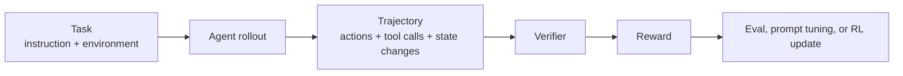

This is why RLVR matters. Reinforcement Learning from Verifiable Rewards replaces subjective judgment with rewards from checkable outcomes: tests, executable feedback, formal validation, tool results, or environment state.

The bottleneck is no longer only model inference. It is trusted reward production.

## Slide 2: The Third-Party Trust Problem

RL reward generation can run on third-party infrastructure only if the reward can be trusted.

That is the real bottleneck. A lab can trust its own cluster. A buyer using third-party operators cannot automatically trust the operator's reward file, logs, or container output.

The missing piece is a way to coordinate incentives around reward production:

- requesters need to escrow payment
- operators need to stake before accepting work
- valid reward claims need to get paid
- invalid or replayed claims need to fail
- eventually, provably bad operators need to be slashable

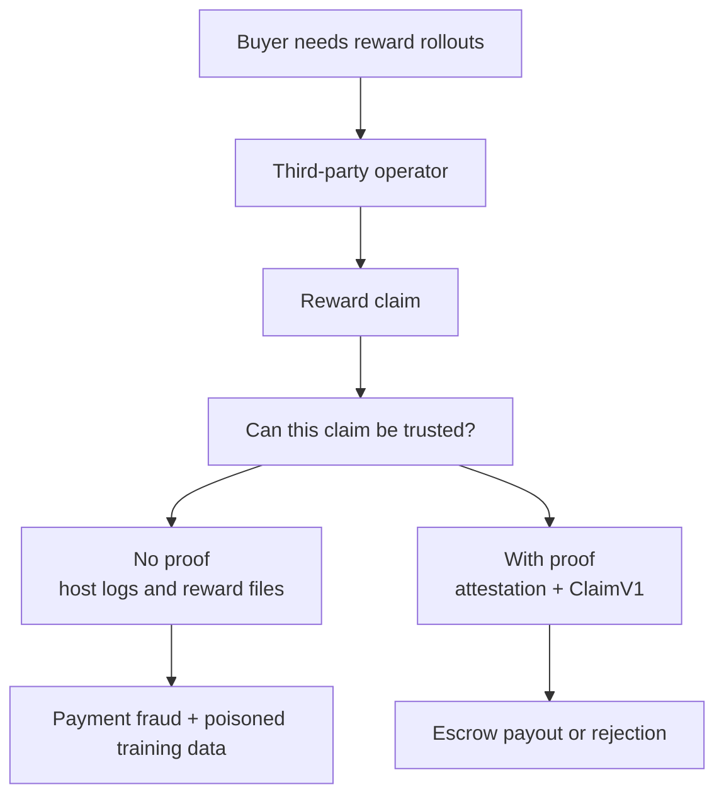

Solana is the neutral coordination layer for escrow, stake, replay protection, payout, and slashing.

AWS Nitro gives the reward claim hardware-rooted evidence.

## Slide 3: The RL Workload

In reinforcement learning, the agent repeatedly moves through an environment. At each step, it sees state, takes an action, receives feedback, and produces a trajectory.

For SolRL's market, the important part is not the equation. It is the workload shape:

- many independent rollouts
- many environment steps
- many verifier calls
- many artifacts
- many repeated runs across model checkpoints, prompts, tools, and datasets

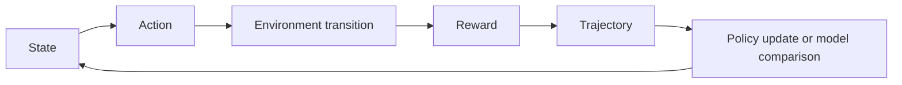

This is different from buying generic CPU time. The customer wants reward data they can safely pay for and train against.

That is the wedge.

## Slide 4: The Incentive Failure

Centralized labs can trust their own machines. A decentralized operator market cannot.

If an operator gets paid per successful rollout, the lowest-cost attack is obvious: skip the real work and return a passing reward. An RL market without enforcement pays for claims, not work.

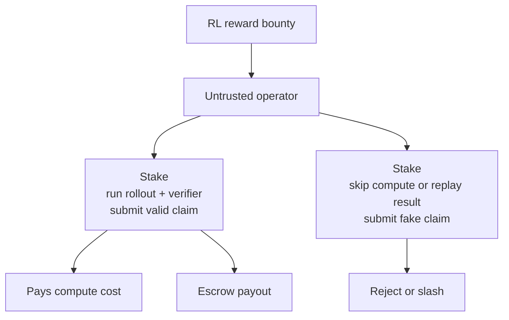

Fake rewards create two losses:

- **payment fraud:** the operator gets paid for work that did not happen
- **training poisoning:** the buyer trains or optimizes against false evidence

The second loss is worse. A bad reward can push the model toward behavior that never solved the task.

## Slide 5: Why Containers Are Not Enough

Containers are useful when the lab owns the host.

They are weak evidence when the host is owned by the operator. The operator can control the runtime, patch the image, tamper with logs, replay old results, or claim a verifier passed when it never ran.

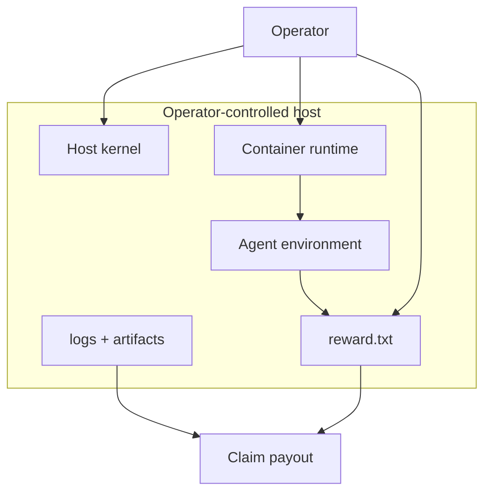

The issue is not that containers are bad. The issue is that host-controlled evidence is not enough for an adversarial reward market.

## Slide 6: Why Nitro Enters The Architecture

AWS Nitro Enclaves are Trusted Execution Environments.

In practical terms, Nitro lets an EC2 instance carve out an isolated VM called an enclave. The parent instance can launch it and communicate over VSOCK, but it cannot SSH into it, mount its disk, read its memory, or inspect its processes.

Nitro enclaves are constrained by design:

- no persistent storage
- no interactive access
- no normal external networking
- no SSH
- local VSOCK communication with the parent

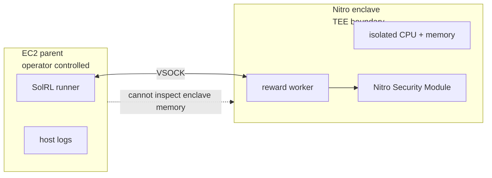

For SolRL, Nitro enters because the operator cannot be the source of truth. The enclave gives the reward worker a boundary the parent host cannot inspect from the outside or rewrite after launch without changing measurements.

## Slide 7: What Attestation Adds

Isolation helps, but the settlement layer needs proof.

Inside the enclave, the worker asks the Nitro Security Module for a signed attestation document. That document is rooted in AWS Nitro Attestation PKI and includes measurements called PCRs.

For SolRL, the important fields are:

- **PCR0, PCR1, PCR2:** measurements of the enclave image, kernel/bootstrap, and application environment
- **PCR16:** SolRL's custom measurement for job and claim context
- **user_data:** the reward or output hash bound into the attestation
- **public_key:** the worker key used to bind the response channel
- **nonce:** replay-resistant input

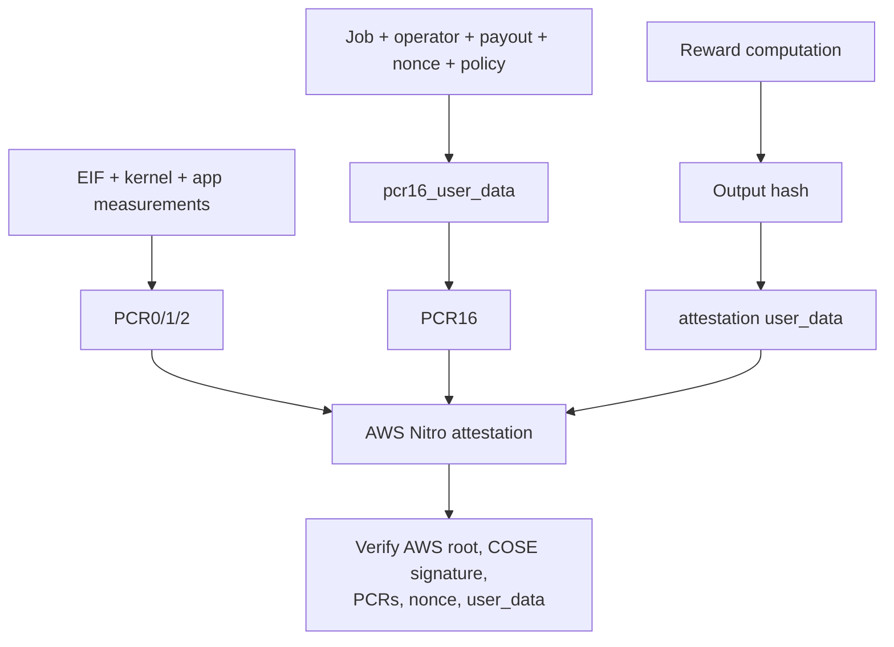

The reward is no longer just a file from an operator-controlled host. It is tied to a hardware-rooted statement about the code and context that produced it.

That is the core primitive.

## Slide 8: What SolRL Adds

Nitro gives a measured execution statement. SolRL turns it into a market action.

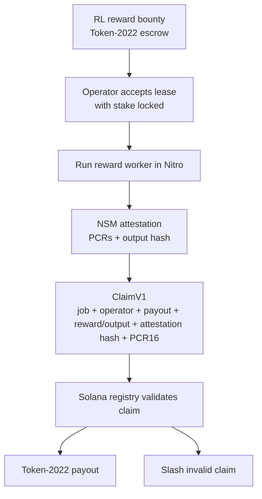

SolRL adds:

- canonical ClaimV1 serialization shared by Rust and Python
- PCR16 binding between Nitro context and registry state
- verifier policy checks
- replay protection with claim and nonce receipts
- Token-2022 escrow payout
- Token-2022 stake slashing
- proof bundles with raw AWS traces and claim artifacts

The result is a reward claim that can drive payment and training decisions without relying on the operator's word.

This is the correct layering:

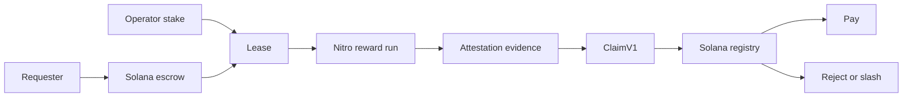

## Slide 9: Why The Token Exists

The token is the market control rail.

SolRL needs one asset that can move through the rollout market:

1. **Escrow:** requesters fund reward generation before work starts.
2. **Stake:** operators lock collateral before accepting leases.
3. **Settlement:** valid ClaimV1 releases escrow to the operator.
4. **Slashing:** valid SlashClaimV1 moves stake to treasury.

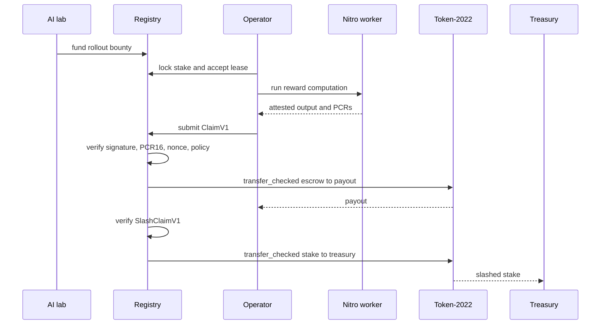

This is not a trading thesis. It is a work-token design: the asset enforces who can take jobs, how they get paid, and what can be taken when they submit invalid work.

Future token design may add fees, routing, reputation, delegation, or burn logic. Those are not V1 claims.

## Slide 10: Why Solana Exists In This Architecture

A reward market needs a neutral place to hold escrow, track stake, reject replay, release payout, and slash bad work. Solana is the incentive and settlement layer for the operators who produce reward data.

Today, V1 uses Token-2022 `transfer_checked` CPI from the registry:

- `settle_claim` moves job escrow to operator payout
- `slash_operator` moves operator stake to treasury
- `withdraw_stake` lets idle operators exit through the same checked transfer path
- a local-validator test proves real Token-2022 balances move

The V1 boundary is explicit: V1 does not use the transfer hook as the full claim verifier. Program-initiated settlement uses registry PDA authority because same-program `registry -> Token-2022 -> registry hook` reentry is rejected by Solana.

The settlement primitive is real Token-2022 account movement, proven by the local-validator balance test.

## Slide 11: Competitive Context

The closest architectural precedent is Marlin Oyster: a TEE-based coprocessor model that shows how enclave execution can be connected to on-chain verification and operator incentives.

SolRL's divergence is focus. It is not trying to become a marketplace for arbitrary backends first. It targets reward rollouts for AI agents and RL workflows, where the buyer has a specific job to be done: produce reward evidence that can be trusted enough to pay for and train against.

| Network | Main wedge | Verification model | SolRL view |
|---|---|---|---|
| Marlin Oyster | General TEE coprocessor workloads | Hardware attestation plus operator incentives | Closest architectural precedent |
| Phala | TEE-backed cloud and privacy-preserving compute | TEE attestation | Broader compute market |
| Akash | Decentralized cloud hosting | Market and validator assurances, not hardware-rooted execution proof by default | Useful supply precedent, weaker reward evidence |
| Bittensor | Incentivized model output markets | Peer evaluation and subnet incentives | Strong AI-network precedent, different trust model |
| SolRL | Verifiable RL reward rollouts | Nitro attestation, ClaimV1, Token-2022 escrow and slashing | Narrower wedge, clearer buyer problem |

The strategic bet is vertical focus. General compute markets are hard to cold start. Reward integrity for third-party RL is narrower, but much easier to explain, test, and sell.

## Slide 12: Current Proof

SolRL V1 proves three connected pieces.

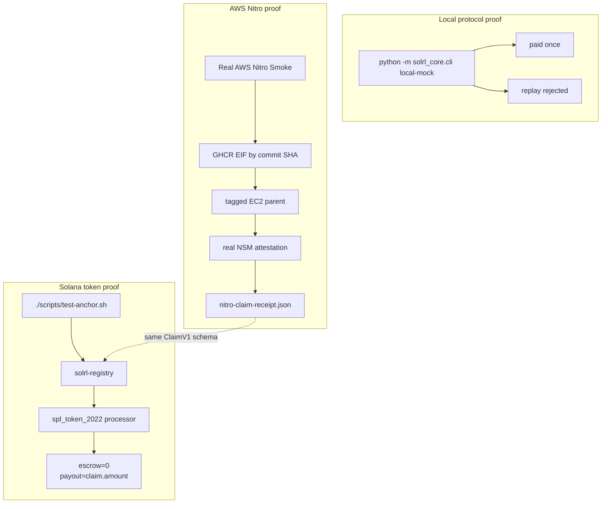

Current shipped evidence:

- real AWS Nitro boot
- commit-pinned GHCR EIF
- COSE/AWS root attestation verification
- non-zero PCR0, PCR1, PCR2, and PCR16 checks
- `SOLRL_PCR16 == SOLRL_CLAIM_PCR16`
- reward-like output hash bound to attestation `user_data`
- ClaimV1 receipt with attestation hash and output hash
- Token-2022 local-validator balance movement
- exact-tag AWS cleanup and post-audit
- self-contained proof bundle

Current boundary: the real AWS proof bundle is not yet submitted to public devnet settlement. V1 proves the hardware reward rail and the token settlement rail, using the same ClaimV1 shape between them. The next integration step is feeding the real AWS ClaimV1 receipt into a public devnet `settle_claim` transaction.

Production Harbor-over-Nitro execution is also future work. The current Nitro worker proves the reward-attestation bridge with generic reward-like compute, not full Harbor tasks.

## Slide 13: How To Evaluate It

The cleanest evaluation path is GitHub Actions because it starts from a clean checkout and leaves run history attached to the repository.

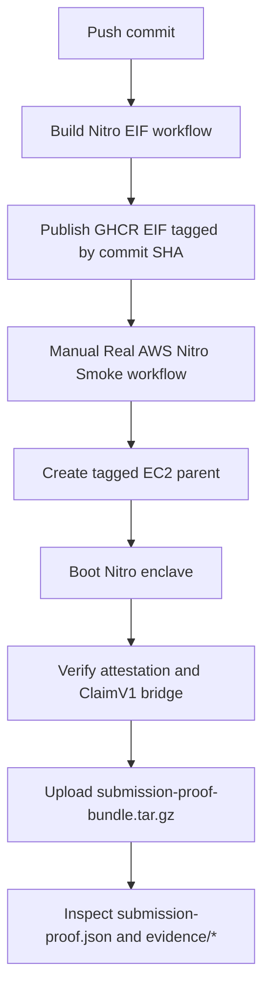

Repository setup:

1. Create a GitHub environment named `aws-gl`.
2. Add an environment secret named `ENV` with AWS credentials in `.env` format.
3. Run `Build Nitro EIF`.
4. Run `Real AWS Nitro Smoke`.
5. Download the uploaded AWS Nitro artifacts.
6. Open `submission-proof-bundle.tar.gz`.

The bundle contains:

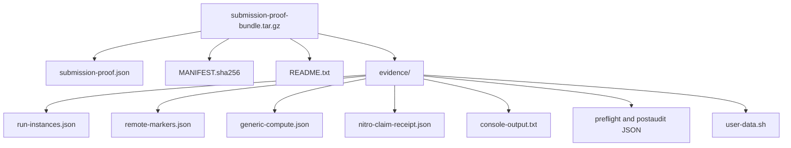

The main checks are mechanical:

- `submission-proof.json.status == "passed"`
- `submission-proof.json.checks.all == true`
- `SOLRL_STATUS == "OK"`
- `SOLRL_PCR16 == SOLRL_CLAIM_PCR16`
- `SOLRL_COMPUTE_OUTPUT_HASH == ClaimV1.trajectory_hash`
- `SOLRL_ATTESTATION_DOCUMENT_HASH == ClaimV1.attestation_document_hash`
- `run-instances.json` shows Nitro enclaves enabled
- `run-instances.json` shows IMDSv2 required
- resource tags include `Project=SolRL`, `SolRLRunId=<run-id>`, and `ManagedBy=SolRL`
- post-audit shows zero SolRL instances, security groups, and volumes left behind

## Slide 14: First Users

The first users are teams that need trusted reward generation at scale:

- AI labs training agents with RLVR
- agent teams running Terminal-Bench, SWE-Bench, or custom executable datasets
- benchmark maintainers who need trusted third-party runs
- model teams optimizing prompts, scaffolds, or tool policies against executable rewards
- DeFi teams simulating fee curves, liquidations, routing, or risk parameters before making on-chain updates
- game teams training autonomous agents whose behavior affects player-owned state
- compute operators selling verified rollout capacity

The product is verified reward rollouts for teams whose training loops depend on reward integrity.

## Slide 15: Why This Can Become A Market

RL rollouts are repeat workloads.

Every model checkpoint, prompt change, scaffold change, tool policy, dataset update, and agent release can create another batch of rollouts. If those runs are trusted only inside a lab's own cluster, the market is limited to centralized infrastructure. If the reward can be verified, operators can compete to supply rollout capacity.

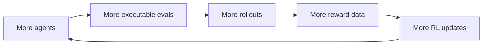

SolRL's wedge is reward integrity for third-party RL. Container speed matters, but it does not answer the incentive or trust question by itself.

## Slide 16: Risks

The risks are real. They should be named clearly.

| Risk | Why it matters | Mitigation path |
|---|---|---|
| AWS concentration | V1 depends on Nitro's trust model and AWS availability | Abstract verifier policy for multiple TEE backends over time |
| Production workload gap | Current Nitro worker proves reward-like compute, not full Harbor/RL jobs | Build Harbor-over-Nitro worker RPC and workload EIF |
| Public settlement gap | Current real AWS proof is not yet submitted to public devnet settlement | Feed Nitro ClaimV1 receipt into devnet `settle_claim` and publish tx evidence |
| Operator cold start | Supply needs real demand to stay online | Start with narrow high-value reward rollouts, not broad compute |
| Verification cost | Raw AWS attestation verification is too heavy for naive on-chain execution | Keep delegated verification and compact ClaimV1 settlement path |
| Token design | Fees, burns, reputation, and routing are not V1 | Treat them as future protocol design, not current claims |

The key technical roadmap is straightforward: connect the real AWS proof bundle to public settlement, then replace the generic worker with production RL workload execution.

## Slide 17: The Investment Case

AI teams need more reward data. RL makes that demand repetitive. Agent environments make it expensive. Third-party infrastructure makes it hard to trust.

SolRL's thesis is that reward integrity becomes a market.

The architecture is deliberately narrow:

- Solana coordinates escrow, stake, payout, and slashing.
- Nitro protects reward computation from the host operator.
- Attestation makes the protected computation auditable.
- ClaimV1 binds the output to job, policy, operator, payout, and PCR16 context.
- Token-2022 moves value when the claim is valid.

That is the business case: a network for producing reward signals that buyers can pay for and models can train against without trusting the machine operator.

## Research Basis

- [Harbor docs](https://www.harborframework.com/docs) describe Harbor as a framework for evaluating and optimizing agents and models in container environments, including custom evals, prompt optimization, RL, SFT traces, and CI/CD agent testing.
- [Harbor eval docs](https://www.harborframework.com/docs/use-cases/evals) describe datasets as Harbor tasks with instruction, environment, and test script, used to evaluate, train, or tune prompts.
- [Harbor dataset docs](https://www.harborframework.com/docs/datasets) describe tasks and datasets for evals and training.
- [Harbor registry](https://registry.harborframework.com/) shows the kind of task market SolRL targets: Terminal-Bench, SWE-Bench Verified, MedAgentBench, LawBench, and other published datasets.
- [RLVR reference](https://rlvrbook.com/) frames RLVR as learning from checkable task outcomes, executable feedback, formal validation, and agent environments.
- [AWS Nitro Enclaves docs](https://docs.aws.amazon.com/enclaves/latest/user/nitro-enclave.html) describe enclaves as isolated, hardened VMs with no persistent storage, no interactive access, and no external networking.
- [AWS Nitro attestation docs](https://docs.aws.amazon.com/enclaves/latest/user/set-up-attestation.html) describe signed attestation documents and PCR measurements.
- [AWS Nitro root verification docs](https://docs.aws.amazon.com/enclaves/latest/user/verify-root.html) describe CBOR/COSE attestation documents signed by AWS Nitro Attestation PKI, including `public_key`, `user_data`, and `nonce`.
- [Marlin Oyster repository](https://github.com/marlinprotocol/oyster-monorepo) is the closest open-source architectural precedent for TEE-backed coprocessor infrastructure.
- [Solana Token-2022 docs](https://www.solana-program.com/docs/token-2022) describe Token-2022 as Solana's extensible token program.
- [Solana token transfer docs](https://solana.com/docs/tokens/basics/transfer-tokens) describe `TransferChecked`, the checked transfer primitive SolRL uses through CPI.

## References

- `README.md` contains the Docker-first verification path and GitHub Actions instructions.
- `.github/workflows/build-nitro-eif.yml` builds and publishes the commit-pinned EIF.
- `.github/workflows/aws-nitro-smoke.yml` runs the real AWS Nitro smoke path and uploads the proof bundle.
- `python/solrl_core/aws_nitro_runner.py` verifies the real Nitro attestation and builds the proof bundle.
- `programs/solrl-registry/tests/registry_flow.rs` contains the local-validator Token-2022 balance test.
- `.agents/skills/solrl-framework/` contains the operating rules for AI agents working on this repo.
