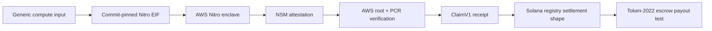
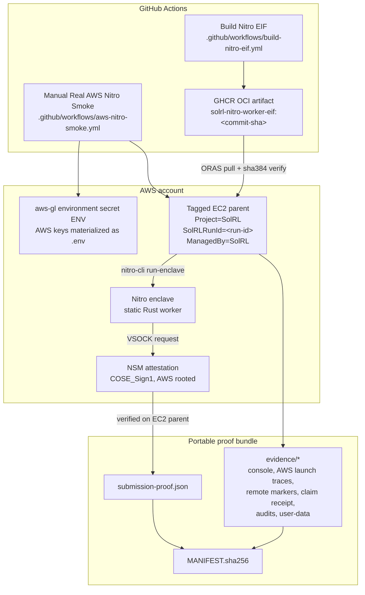
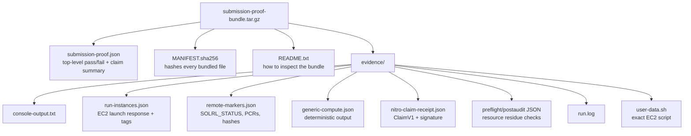
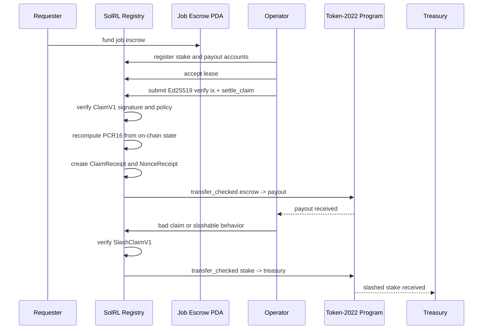
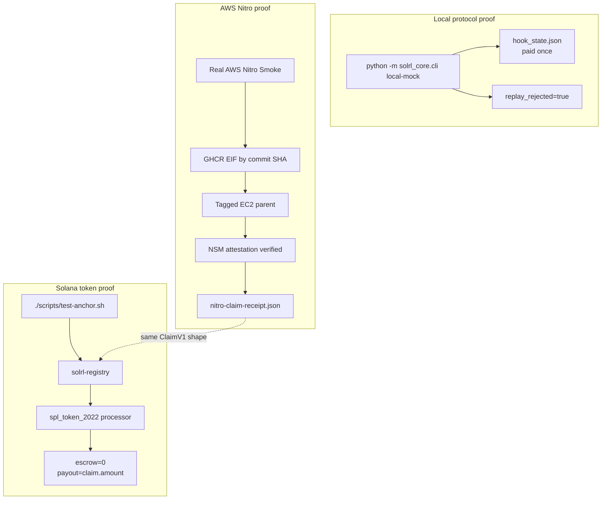
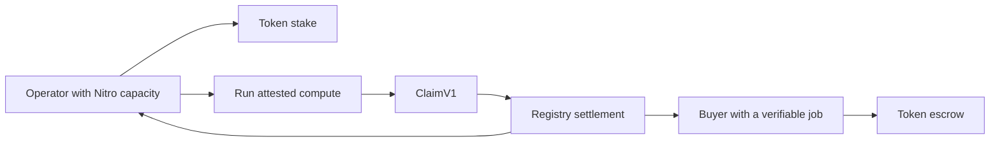
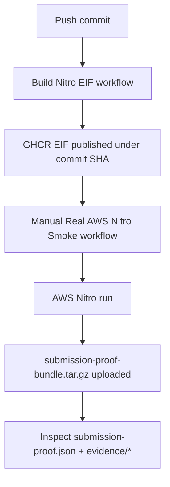

# Why SolRL

SolRL turns off-chain compute into evidence a blockchain program can pay for.

The narrow V1 claim is simple: run deterministic compute inside AWS Nitro, verify the real NSM attestation, bind the result into ClaimV1, and prove the Solana Token-2022 settlement rail moves value under registry PDA authority.

That is enough to start.

## Slide 1: The Problem

Decentralized compute has a blunt failure mode: the operator can lie.

A requester posts a job. An operator claims it ran. The operator returns a result and asks to be paid. If the requester cannot verify where the code ran, what image ran, what inputs were bound, and whether the output came from that environment, the market collapses into screenshots and trust. Not great.

The same problem shows up in agent evaluation, batch scoring, data processing, model checks, and any workload where the result is valuable but the machine is owned by someone else. The user wants to buy work, not vibes.

SolRL's job is to make the payment decision boring:

- Was the compute run inside the expected hardware boundary?
- Did the attested image produce the expected output hash?
- Did the claim bind the same context the Solana registry expects?
- Did the token escrow move only once?

If the answer is yes, pay. If not, reject or slash.

## Slide 2: What Works Today

SolRL V1 is not a generic sandbox platform yet. It is the proof chain for generic hardware-attested compute and token settlement.

Current shipped pieces:

- A GitHub Actions workflow builds the Nitro EIF from the repo and publishes it to GHCR under the commit SHA.
- A manual GitHub Actions workflow launches a real tagged AWS Nitro EC2 parent using the repository environment `aws-gl` and environment secret `ENV`.
- The EC2 parent pulls the commit-pinned EIF, verifies its SHA-384 sidecar, boots the enclave, runs deterministic generic compute, requests a real NSM attestation, and verifies the COSE/AWS root/PCR/user-data chain.
- The Nitro proof writes `nitro-claim-receipt.json`, binding the verified attestation document hash, compute output hash, and PCR16 into ClaimV1.
- The Solana registry program has Token-2022 escrow, stake, payout, slashing, replay protection, and a local-validator Token-2022 balance test for `settle_claim`.
- The runner emits a self-contained `submission-proof-bundle.tar.gz` with the JSON proof and raw AWS traces needed to audit the run.

What this proves today:



The production Harbor worker is not part of V1. Harbor remains a future workload target once the VSOCK worker RPC and Harbor-bearing EIF exist.

## Slide 3: The Evidence Chain

The useful thing about SolRL is not that it prints a green log line. It leaves a trail.



The manual workflow is the easiest public verification path. It does the same thing the local Docker command does, but from a clean GitHub runner:

1. Create repository environment `aws-gl`.
2. Add environment secret `ENV` with the same key/value lines as local `.env`.
3. Wait for `Build Nitro EIF` to publish the GHCR artifact for the commit.
4. Run `Real AWS Nitro Smoke` manually.
5. Download the uploaded AWS Nitro artifact.
6. Inspect `submission-proof-bundle.tar.gz`.

The workflow validates the bundle before uploading it. A reviewer can still unpack it and check the same evidence independently.

## Slide 4: What The Proof Bundle Contains

The proof bundle is intentionally self-contained. It should not point at loose local files and ask the reader to trust the operator's laptop.



The important checks are mechanical:

- `submission-proof.json.status == "passed"`
- `submission-proof.json.checks.all == true`
- `SOLRL_STATUS == "OK"`
- `SOLRL_PCR16 == SOLRL_CLAIM_PCR16`
- `SOLRL_COMPUTE_OUTPUT_HASH == ClaimV1.trajectory_hash`
- `SOLRL_ATTESTATION_DOCUMENT_HASH == ClaimV1.attestation_document_hash`
- `run-instances.json` shows `EnclaveOptions.Enabled == true`
- `run-instances.json` shows IMDSv2 required
- resource tags include `Project=SolRL`, `SolRLRunId=<run-id>`, and `ManagedBy=SolRL`
- post-audit shows zero SolRL instances, security groups, and volumes left behind

This is the right shape for a skeptical reader. The claim is not "believe our README." The claim is "open the tarball and verify the hashes, AWS launch trace, attestation-derived markers, ClaimV1 receipt, and cleanup audit."

## Slide 5: Token Settlement

SolRL needs a token because payment and enforcement need to live on the same rail.

The Token-2022 mint is the protocol control plane:

- **Escrow.** Requesters fund a job by moving tokens into a per-job escrow PDA.
- **Staking.** Operators lock tokens before taking leases.
- **Settlement.** A valid ClaimV1 releases escrow to the operator payout account.
- **Slashing.** A valid SlashClaimV1 moves stake to treasury.
- **Replay protection.** Claim receipts and nonce receipts make the second settlement attempt collide.



The current token boundary is precise:

- `settle_claim` and `slash_operator` use Token-2022 `transfer_checked` CPI.
- The local-validator test `settle_claim_transfers_token2022_balance_with_registry_pda_authority` creates a real Token-2022 mint and token accounts, funds escrow, sends the settlement transaction, and asserts escrow drains while payout receives the claim amount.
- The local mock path proves paid-once and replay-rejected semantics with deterministic artifacts.
- V1 does not claim hook-side claim verification. Program-initiated settlement uses registry PDA authority because Solana rejects same-program `registry -> Token-2022 -> registry hook` reentry.

This is not tokenomics. It is the minimum token mechanism that makes the compute market enforceable.

## Slide 6: Current Architecture

SolRL has three proof lanes. They are separate on purpose because each answers a different question.



The dotted line matters. Today, the real AWS run produces a ClaimV1 receipt tied to the hardware proof. The local-validator test proves the registry moves Token-2022 balances for a valid ClaimV1. The next integration step is a public devnet transaction that feeds the real AWS ClaimV1 receipt directly into `settle_claim` and records the transaction signature.

That is the honest boundary.

## Slide 7: Who Uses This

The first users are builders who need to pay for off-chain compute without trusting the operator:

- protocols buying batch compute from independent operators
- AI teams evaluating code-verifiable tasks
- data pipelines where the output hash is valuable and the worker is untrusted
- marketplaces that want staking, escrow, and slashing around compute jobs
- research teams that need portable evidence for a run, not just logs

The short-term product is not "all compute everywhere." That is how infra projects wander into the swamp.

The useful first product is a narrow attested-compute payment rail:



If the buyer can define the work and verify the result by code, SolRL can eventually make that work payable across untrusted operators.

## Slide 8: Market Direction

The market starts where verification is already code:

- deterministic batch jobs
- benchmark scoring
- code tests
- model evaluation harnesses
- reproducible data transforms
- future RL reward generation

The reason this can matter is simple: centralized compute providers sell execution, but they do not sell a blockchain-native proof that safely releases escrow from an untrusted operator.

SolRL's wedge is not cheaper containers. Daytona-style fast containers and Sysbox-like isolation are good for developer experience, but they do not give a hardware-rooted proof the host cannot forge. SolRL spends the AWS Nitro cost only where the result needs to move money.

This makes the target customer narrower and more real: users who need attested compute enough to pay the latency and cost tax.

## Slide 9: What Is Not Built Yet

Several things are deliberately not claimed by V1:

- Production Harbor-over-Nitro execution. The Harbor import path exists for local mode; AWS mode intentionally errors.
- A Harbor-bearing EIF that runs arbitrary evaluation tasks inside the enclave.
- A persistent verifier enclave service that continuously ingests real AWS COSE attestations and signs on-chain claims.
- A public devnet settlement transaction from the latest real AWS proof bundle.
- Hook-side claim verification. V1 uses registry PDA authority for program-initiated settlement.
- A requester/operator UI.
- Production token mint governance, emissions, reputation routing, and dispute policy.
- Threshold verifier signatures.
- Open-internet workload policy. V1 network policy is `DenyAll`.

This list is part of the product. If a project cannot name what it does not do, it is usually hiding it from itself.

## Slide 10: What To Run

For an external reviewer, the cleanest path is GitHub Actions:



Local verification commands still exist and are useful while developing:

```bash
docker compose run --rm lint
docker compose run --rm --no-deps harbor-runner python -m solrl_core.cli local-mock --config solrl.toml --work-dir artifacts/mock
docker compose run --rm --no-deps dev-shell ./scripts/test-anchor.sh
docker compose run --rm aws-nitro-runner python3 -m solrl_core.aws_nitro_runner audit --scope project
docker compose run --rm aws-nitro-runner
```

The GitHub path is better for review because it starts from a clean checkout, pulls the commit-pinned EIF from GHCR, creates a fresh AWS run id, uploads the proof bundle, and leaves the result attached to the repository run history.

## Slide 11: Why This Is Worth Building

There is no one at the wheel in off-chain compute markets. That is the opportunity.

The real product is not a fancier sandbox. The product is a feedback loop:

1. a buyer posts verifiable work,
2. an operator runs it in a hardware boundary,
3. the result becomes ClaimV1 evidence,
4. the registry releases escrow or slashes stake,
5. the proof bundle lets anyone inspect what happened.

That feedback loop is how generic compute becomes a market instead of a Discord handshake.

SolRL V1 is the smallest version that makes the loop concrete. Generic compute first. Harbor and RL workloads later.

## References

- `README.md` contains the Docker-first verification path and the GitHub Actions workflow instructions.
- `.github/workflows/build-nitro-eif.yml` builds and publishes the commit-pinned EIF.
- `.github/workflows/aws-nitro-smoke.yml` runs the real AWS Nitro smoke path and uploads the proof bundle.
- `programs/solrl-registry/tests/registry_flow.rs` contains the local-validator Token-2022 balance test.
- `.agents/skills/solrl-framework/` contains the operating rules for AI agents working on this repo.
